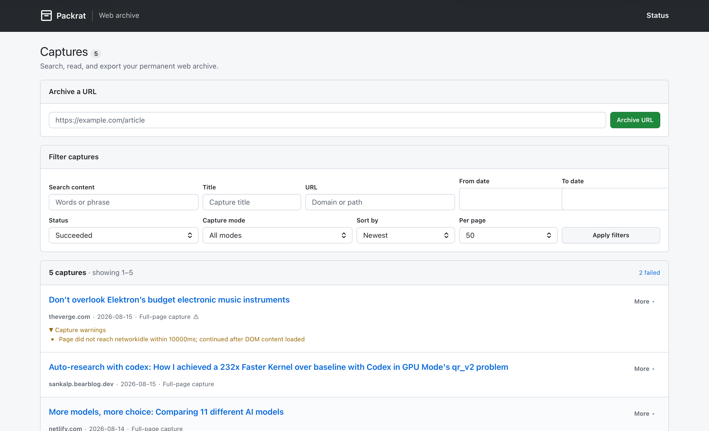

# bun-packrat



`bun-packrat` captures rendered web pages into SQLite. New captures use Chromium MHTML as the source of record and derive safe offline HTML, Article, Markdown, EPUB and PDF views on demand.

The service runs on Bun with SQLite FTS5, an in-process job queue and Playwright. It is designed for desktop browsers and Safari on iPhone and iPad.

## Features

- one SQLite database for captures, metadata, search, tags and jobs;
- canonical Chromium MHTML with SHA-256 verification;
- offline full-page and simplified Article views;
- server-side full-text search, filters and pagination;
- HTML, Markdown ZIP, EPUB 3 and on-demand PDF exports;
- HTTP API, bookmarklet and Bun CLI;
- HTTP Basic authentication by default;
- consistent online backup and integrity verification.

## Start with Docker

Set a password, then build and start the service:

```bash
export PACKRAT_AUTH_PASSWORD='replace-with-a-secret'
make up
```

Open <http://localhost:3047/> and sign in as `packrat`.

For an unauthenticated service on a trusted network, set `PACKRAT_AUTH_DISABLED=1` explicitly.

## Develop locally

```bash
bun install
bun run typecheck
bun test
PACKRAT_AUTH_DISABLED=1 bun run src/server.ts
```

The default database path is `./data/packrat.db`.

## Project status

Fresh capture, search, offline reading, export, deletion, backup and verification are implemented and tested. The ArchiveBox bulk importer and final hostname cutover are planned.

See the [documentation index](docs/README.md) for setup, configuration, architecture, API, CLI and operations. Requirements and delivery status are tracked in the [product requirements](docs/PRD.md) and [implementation plan](docs/PLAN.md).

## Licence

[MIT](LICENSE) © 2026 Rui Carmo
