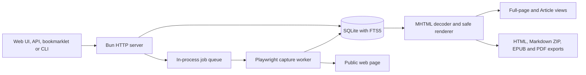
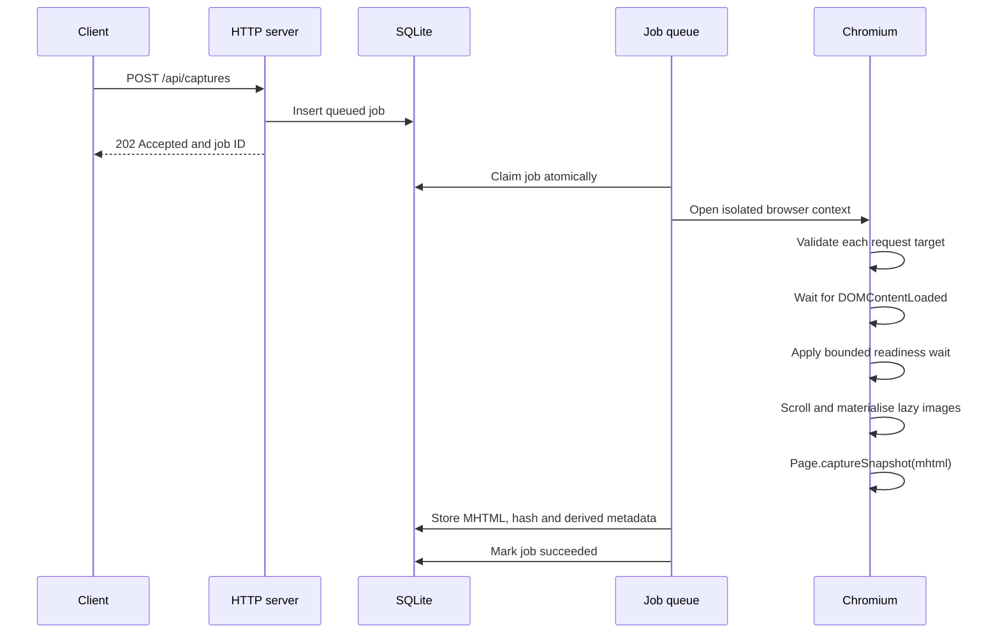
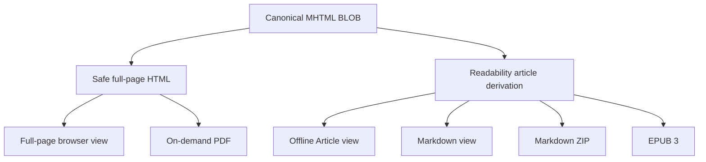

# Architecture

Packrat stores each successful fresh capture as canonical Chromium MHTML in SQLite. Browser views and exports are derived from that stored snapshot without fetching the source page again.

## Components



The service has no external queue or search daemon. Browser profiles and temporary export files are disposable runtime data.

## Capture flow



`DOMContentLoaded` is required. `load` or `networkidle`, when configured, is a settling signal bounded to 10 seconds. A page that keeps analytics or media connections open can still produce a valid capture.

The browser request handler resolves each HTTP or HTTPS origin and rejects loopback, link-local, private and reserved addresses. The final URL is checked again after navigation.

## Stored and derived content



MHTML is the source of record for fresh captures. Readability supplies title, author, article text and simplified content. It does not replace the stored page.

The safe renderer decodes captured MIME resources and embeds CSS, images and fonts as local data. It removes scripts, forms, frames, plug-ins, executable attributes, unresolved resources, refresh redirects and active media.

Legacy captures can contain stored HTML. Content sniffing keeps those records readable, but they cannot provide canonical MHTML downloads.

## Capture modes

| Mode | Meaning |
|---|---|
| `full_page` | Fresh canonical MHTML or legacy sanitised full-page HTML. |
| `article` | Legacy Readability-based canonical HTML. |
| `imported_singlefile` | Validated ArchiveBox SingleFile output. Planned for the importer. |
| `metadata_only` | URL and metadata without a usable page body. |

## Data model

SQLite uses WAL mode and foreign-key enforcement.

| Table | Purpose |
|---|---|
| `captures` | Stored body, hash, mode, status and extracted metadata. |
| `urls` | Normalised URL identity and latest capture reference. |
| `capture_aliases` | Redirect and alternate URLs for a capture. |
| `metadata` | Extensible capture metadata, including image provenance. |
| `tags` | User-defined tags. |
| `capture_tags` | Capture-to-tag relation. |
| `jobs` | Queued, running, succeeded, failed and cancelled jobs. |
| `attempts` | Bounded diagnostic history for job attempts. |
| `archivebox_imports` | Planned ArchiveBox provenance and migration outcomes. |
| `captures_fts` | FTS5 index over title, site, author, URL, domain and body text. |
| `schema_migrations` | Applied schema versions. |

## Offline rendering policy

Archived HTML and Article responses use this Content Security Policy:

```text
Content-Security-Policy: default-src 'none'; style-src 'unsafe-inline'; img-src data:; font-src data:; base-uri 'none'; form-action 'none'; frame-ancestors 'none'
```

Full-page and Article views make no external requests. Markdown mode can expose original image hosts only after the user enables remote images for that view.

## Source layout

| Path | Responsibility |
|---|---|
| `src/capture/` | URL validation, Playwright capture, MHTML rendering, extraction and sanitisation. |
| `src/db/` | Schema migrations and database operations. |
| `src/queue/` | SQLite-backed in-process worker queue. |
| `src/export/` | HTML, Markdown, EPUB and PDF derivation. |
| `src/cli/` | Command-line interface. |
| `src/server.ts` | HTTP routes and server-rendered UI. |
| `tests/` | Unit and integration tests. |
