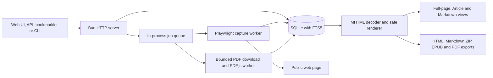
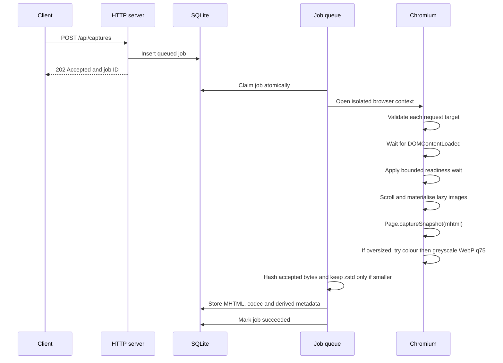
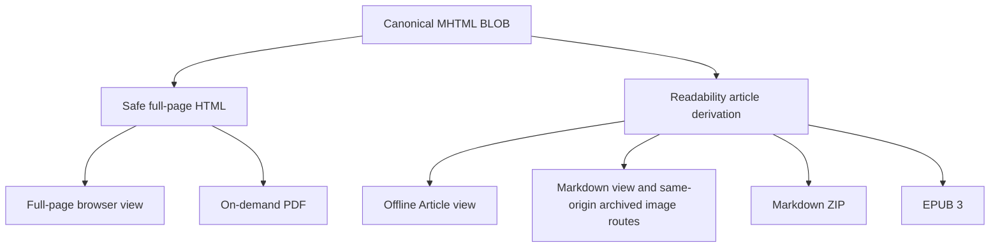

# Architecture

Packrat v0.3.0 stores successful web captures as Chromium MHTML in SQLite and stores direct PDF responses byte-for-byte in separate content-addressed BLOB rows. Oversized snapshots may replace embedded JPEG, PNG and WebP MIME parts through a fixed two-pass fallback, and capture bodies use zstd only when it reduces stored bytes.

## Components



The service has no external queue or search daemon. Browser profiles and temporary export files are disposable runtime data.

## Capture flow



`DOMContentLoaded` is required. `load` or `networkidle`, when configured, is a settling signal bounded to 10 seconds. A page that keeps analytics or media connections open can still produce a valid capture.

The browser request handler resolves each HTTP or HTTPS origin with a ten-second DNS bound and rejects loopback, link-local, private and reserved addresses. The final URL is checked again after navigation. Capture and PDF operations use bounded waits. A queue watchdog exits the process if a capture remains unresolved for the larger of five minutes or four times the capture timeout. Bun runs with `--no-orphans` so process exit also kills descendant Chromium processes; normal startup recovery then closes abandoned pending captures and requeues eligible jobs.

## Stored and derived content



Accepted MHTML is the source of record for fresh captures. MHTML within the configured size limit remains byte-exact before storage compression. For an oversized snapshot, Packrat processes embedded JPEG, PNG and WebP parts sequentially: colour WebP quality 75 first, then greyscale WebP quality 75 if required. It replaces a part only when the encoded bytes are smaller and stores only the first rebuilt MHTML that fits. Readability supplies title, author, article text and simplified content. It does not replace the stored page.

The safe renderer decodes captured MIME resources and embeds CSS, images and fonts as local data. It removes scripts, forms, frames, plug-ins, executable attributes, unresolved resources, refresh redirects and active media.

Legacy captures can contain stored HTML. Content sniffing keeps those records readable, but they cannot provide canonical MHTML downloads.

## Capture modes

| Mode | Meaning |
|---|---|
| `full_page` | Fresh canonical MHTML or legacy sanitised full-page HTML. |
| `article` | Legacy Readability-based canonical HTML. |
| `imported_singlefile` | Validated and normalised ArchiveBox SingleFile output. |
| `metadata_only` | URL and metadata without a usable page body. |
| `pdf` | Byte-exact source PDF with bounded extracted text. |

## Data model

SQLite uses WAL mode and foreign-key enforcement.

| Table | Purpose |
|---|---|
| `captures` | Stored body, hash, mode, status and extracted metadata. |
| `urls` | Normalised URL identity and latest capture reference. |
| `capture_aliases` | Redirect and alternate URLs for a capture. |
| `metadata` | Extensible capture metadata, including image provenance. |
| `tags` | User-defined tags. |
| `capture_tags` | Capture-to-tag relation. |
| `jobs` | Queued, running, succeeded, failed and cancelled jobs. |
| `attempts` | Bounded diagnostic history for job attempts. |
| `archivebox_imports` | ArchiveBox provenance and migration outcomes. |
| `pdf_blobs` | SHA-256-deduplicated byte-exact source PDFs. |
| `capture_pdfs` | Capture-to-PDF relation and original-response provenance. |
| `pdf_extractions` | PDF.js status, page count, bounded text and warnings. |
| `archivebox_pdf_enrichment` | Independent resumable outcome for every ArchiveBox row. |
| `capture_storage_migrations` | Durable changed, retained or failed outcome for each storage-migration row. |
| `captures_fts` | FTS5 index over title, site, author, URL, domain and body text. |
| `schema_migrations` | Applied schema versions. |

Migrations `001_initial.sql` through `007_storage_migration_state.sql` define the v0.3.0 schema. Migration `005` adds body-format metadata and FTS trigger updates. Migration `006` adds source-PDF storage, associations, extraction state and ArchiveBox PDF-enrichment outcomes. Migration `007` adds durable per-row storage-migration outcomes. The storage migration verifies and recompresses one body at a time.

## Offline rendering policy

Archived HTML and Article responses use this Content Security Policy:

```text
Content-Security-Policy: default-src 'none'; style-src 'unsafe-inline'; img-src data:; font-src data:; base-uri 'none'; form-action 'none'; frame-ancestors 'none'
```

Full-page and Article views make no external requests. The rendered Markdown reader resolves images to authenticated, same-origin `/captures/:id/images/:index` resources when matching archived bytes are available. Missing archived images remain alt text unless the user enables the privacy-gated remote fallback. Its `.raw` companion exposes the same mixed archived/fallback Markdown source. The agent-facing API Markdown retains original URLs, while Markdown ZIP exports use offline relative assets.

The Markdown archived-image decoder uses a bounded 32 MiB in-process least-recently-used cache. A Bun `memoryPressure` handler clears this cache. The decoder does not create persistent derived files or alter stored HTML, MHTML or PDF bytes.

## Source layout

| Path | Responsibility |
|---|---|
| `src/capture/` | URL validation, Playwright capture, JPEG/PNG/WebP MIME-part recompression, body codecs, rendering, extraction and sanitisation. |
| `src/db/` | Schema migrations and database operations. |
| `src/queue/` | SQLite-backed in-process worker queue. |
| `src/export/` | HTML, Markdown, EPUB and rendered PDF derivation. |
| `src/pdf/` | Bounded source-PDF download and isolated PDF.js extraction. |
| `src/cli/` | Command-line interface. |
| `src/server.ts` | HTTP routes and server-rendered UI. |
| `tests/` | Unit and integration tests. |
